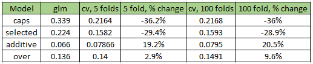
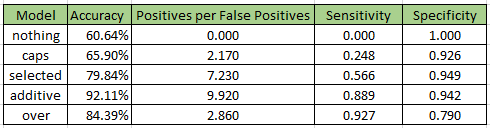
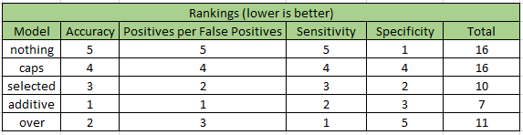

```{r setup, include=FALSE}
knitr::opts_chunk$set(echo = TRUE)
```

## Exercise 1 (first part)

# 1. Execute the code above. Based on the results, rank the models from "most underfit" to "most overfit"
```{r, warning = FALSE}
library(kernlab)
library(ggplot2)
data("spam")
tibble::as.tibble(spam)

is.factor(spam$type)
levels(spam$type)

set.seed(42)
# spam_idx = sample(nrow(spam), round(nrow(spam) / 2))
spam_idx = sample(nrow(spam), 1000)
spam_trn = spam[spam_idx, ]
spam_tst = spam[-spam_idx, ]

fit_caps = glm(type ~ capitalTotal,
               data = spam_trn, family = binomial)
fit_selected = glm(type ~ edu + money + capitalTotal + charDollar,
                   data = spam_trn, family = binomial)
fit_additive = glm(type ~ .,
                   data = spam_trn, family = binomial)
fit_over = glm(type ~ capitalTotal * (.),
               data = spam_trn, family = binomial, maxit = 50)

# training misclassification rate
mean(ifelse(predict(fit_caps) > 0, "spam", "nonspam") != spam_trn$type)
mean(ifelse(predict(fit_selected) > 0, "spam", "nonspam") != spam_trn$type)
mean(ifelse(predict(fit_additive) > 0, "spam", "nonspam") != spam_trn$type)
mean(ifelse(predict(fit_over) > 0, "spam", "nonspam") != spam_trn$type)

library(boot)
set.seed(1)
cv.glm(spam_trn, fit_caps, K = 5)$delta[1]
cv.glm(spam_trn, fit_selected, K = 5)$delta[1]
cv.glm(spam_trn, fit_additive, K = 5)$delta[1]
cv.glm(spam_trn, fit_over, K = 5)$delta[1]
```


Overfit or underfit was decided based upon the change in the misclassification rate before and after cross validation. If cross validation increased the misclassification rate, then the model was overfit and vice versa. 
 - fit_caps  
 - fit_selected 
 - fit_over 
 - fit_additive


# 2. Re-run the code above with 100 folds and a different seed. Does your conclusion change?

```{r, warning = FALSE}
set.seed(3)
cv.glm(spam_trn, fit_caps, K = 100)$delta[1]
cv.glm(spam_trn, fit_selected, K = 100)$delta[1]
cv.glm(spam_trn, fit_additive, K = 100)$delta[1]
cv.glm(spam_trn, fit_over, K = 100)$delta[1]
```


No, the conclusion does not change as the order of percentage change in the misclassification rate has not changed. 


## Exercise 1 (part 2)

# 3. Generate four confusion matrices for each of the four models fit in Part 1.

```{r, warning = FALSE}
make_conf_mat = function(predicted, actual) {
  table(predicted = predicted, actual = actual)
}

#############caps########
spam_tst_pred = ifelse(predict(fit_caps, spam_tst, type = "response") > 0.5,
                       "spam",
                       "nonspam")
(conf_mat_caps = make_conf_mat(predicted = spam_tst_pred, actual = spam_tst$type))
(accuracy_caps <-length(which(spam_tst_pred==spam_tst$type))/length(spam_tst$type))

############selected##############
spam_tst_pred = ifelse(predict(fit_selected, spam_tst, type = "response") > 0.5,
                       "spam",
                       "nonspam")
(conf_mat_selected = make_conf_mat(predicted = spam_tst_pred, actual = spam_tst$type))
(accuracy_selected <-length(which(spam_tst_pred==spam_tst$type))/length(spam_tst$type))

###########additive############
spam_tst_pred = ifelse(predict(fit_additive, spam_tst, type = "response") > 0.5,
                       "spam",
                       "nonspam")
(conf_mat_additive = make_conf_mat(predicted = spam_tst_pred, actual = spam_tst$type))
(accuracy_additive <-length(which(spam_tst_pred==spam_tst$type))/length(spam_tst$type))

###########over##############
spam_tst_pred = ifelse(predict(fit_over, spam_tst, type = "response") > 0.5,
                       "spam",
                       "nonspam")
(conf_mat_over = make_conf_mat(predicted = spam_tst_pred, actual = spam_tst$type))
(accuracy_over <-length(which(spam_tst_pred==spam_tst$type))/length(spam_tst$type))

############table############
table(spam_tst$type) / nrow(spam_tst)
```


```{r, echo=FALSE, out.width='90%'}

```


# 4. Which is the best model? Write 2 paragraphs justifying your decision. You must mention (a) the overall accuracy of each model; and (b) whether some errors are better or worse than others, and you must use the terms specificity and sensitivity. For (b) think carefully... misclassified email is a pain in the butt for users!

  The best model is the additive model (a model that uses all the variables). A few different metrics were used to determine this. The first is overall accuracy. The additive model had a much higher overall accuracy than the other models. Next, sensitivity, or the true positive rate helps show how much percent of the total spam is being identified (assuming spam is positive since it is coded as 1).  The additive model was a close second at this. The specificity rate shows how much percent of the total nonspam is classified properly. The additive model was a very close second as this.
  
  
  Finally, an additional metric was created that presents the number of spam detected per nonspam detected as spam (positives per false positives). This metric is especially important for this application as a nonspam email that is classified as spam is the worst error case. This can lead a user to miss important information (even more important than free shipping at a site shopped at 7 years ago). The additive model and the selected model are the only models that perform well in this metric. Each model was ranked for each metric evenly and the rankings were totaled as shown in Table 3 (lower is better). 
  

```{r, echo=FALSE, out.width='90%'}


```
```{r, echo=FALSE, out.width='90%'}


```

## Exercise 2


```{r, warning = FALSE}
#bank <-read.csv("bank.csv",header=TRUE) #local copy, change to web once fixed
bank <-as.data.frame(read.table("https://msudataanalytics.github.io/SSC442/Labs/data/bank.csv",
                                header = TRUE,sep = ","))
tibble::as.tibble(bank)
is.factor(bank$y)
levels(bank$y)

bank$job_collapsed = ifelse(bank$job %in% c('blue-collar','housemaid','technician',
                                            'services'),"blue-collar", 
ifelse(bank$job %in% c("entrepreneur","admin.","management","self-employed"), "white-collar", 
ifelse(bank$job %in% c("student","retired","unemployed"), "not-working",
ifelse(bank$job %in% c("unknown"), "unknown", NA))))

set.seed(15)
bank_idx = sample(nrow(bank), round(nrow(bank) / 2))
bank_trn = bank[bank_idx, ]
bank_tst = bank[-bank_idx, ]

#bank_reg <- glm(y ~ .,data = bank_trn, family = binomial)
bank_reg <- glm(y~ job_collapsed + marital + housing + loan + contact + 
                  day + month + poly(duration,2) + 
                  previous,data = bank_trn, family = binomial)
#Discuss coefficients in markdown
set.seed(3)
cv.glm(bank_trn, bank_reg, K=10)$delta[1]

bank_tst_pred = ifelse(predict(bank_reg, bank_tst, type = "response") > 0.5,
                       "yes",
                       "no")
(conf_mat_bank_reg = make_conf_mat(predicted = bank_tst_pred, actual = bank_tst$y))
(accuracy_bank_reg <-length(which(bank_tst_pred==bank_tst$y))/length(bank_tst$y))


```


# Interpretations of the Coefficients

job_collapsed shows the effect of the type of job someone has on their likeliness to deposit. Types are blue collar, not working, unknown, and white collar. A positive coefficient shows an increased likelihood to deposit based upon someone falling into that category. 

marital is a categorical variable that shows whether someone is single, married, or divorced. Married and single both have negative coefficients showing that people in these categories are less likely to deposit.

housing has two categories, yes and no. This is assumed to refer to whether or not someone owns a house. Those with a house had a negative coefficient, meaning they are less likely to deposit. 

loan has two categories, yes and no. This simply shows whether or not someone currently has a loan. As one might expect, those who currently have a loan are less likely to deposit, as shown by the negative coefficient on yes. 

contact is a categorical variable that shows whether the call was placed to a landline, a cell phone, or not known. Those on landlines were more likely to deposit as shown by the positive coefficient. Those with unknown methods of contact were shown to be less likely to deposit as shown by the negative coefficient on unknown.

month is a categorical variable for what month it is. The coefficient on each month shows whether deposits were more or less likely in each month. Positive coefficients show that someone is more likely to deposit in that month and negative coefficient show that someone is less likely to deposit in that month.

duration is a continuous variable that is the number of seconds the phone conversation was. A second degree polynomial was used for this variable for better fit. The linear term has a positive coefficient and the squared term has a negative coefficient. This suggests that as phone conversations become long, there are diminishing returns to the likelihood of someone depositing. 

previous is a continuous variable that shows how many times someone has been called before. As many cheesy quotes would suggest, persistence pays. The positive coefficient shows that as the number of times someone has been called increases, the likelihood of someone depositing increases. 


