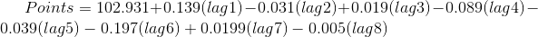
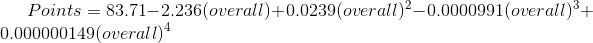

```{r setup, include=FALSE}
knitr::opts_chunk$set(echo = TRUE)
library(ggplot2)
library(dplyr)
library(rpart)
library(kernlab)
library(caret)
library(DescTools)
```


### Goal
- Does tanking in the NHL lead to team success in the future?

To answer this we used a variety of ways to determine what a draft pick is actual worth, in terms of impact once the player earns an entry level NHL contract, the amount of points a draft pick is expected to produce, and the the probabiliy of a player actually playing in the NHL.

Along with this we explored a number of interesting topics including the impact of an NHL team's legacy based on the age of the organization and the NHL city's climate on a team's point total. 


### Import and Clean Data

Here we load in our datasets which tell us:

  - Draft results since 1991, with variables like round selected, overall, nationality, age, position, amateur       league, and some NHL career stats of that player

  - End of season standings since 1991, complete with points totals and more statistics

  - Individual skater and goalie statistics for each season since 1991

  - Each NHL organization's years since being founded, and the current city's temperature data


Using the draft result and skater datasets, we created a new dataset with each drafted players statistics for their first 3 seasons played in the NHL (which is the length of an entry level contract)


```{r}

################## import draft data ####################
draft <- read.csv("https://raw.githubusercontent.com/potierku/talk_data_to_me/master/final_project/draft.txt",stringsAsFactors = FALSE)
#delete rows with 2017,2018,2019
draft <- draft[-which(draft$Year %in% c("2016","2017","2018","2019")),]
draft$Pos[which(draft$Pos %in% c("","W","F"))]=NA #replace blanks with NA

#replace NA values in stats with 0
draft$GP[is.na(draft$GP)] <-0
draft$G[is.na(draft$G)] <-0 
draft$A[is.na(draft$A)] <-0 
draft$PTS[is.na(draft$PTS)] <-0 
draft$plus_minus[is.na(draft$plus_minus)] <-0 
draft$PIM[is.na(draft$PIM)] <-0 

#replace POS that is blank with NI (no information) 
draft$Pos <- as.character(draft$Pos)
draft$Pos[which(is.na(draft$Pos))] <- "unknown"
draft$Pos <- as.factor(draft$Pos)

##################### import standings data ####################
standings <- read.csv("https://raw.githubusercontent.com/potierku/talk_data_to_me/master/final_project/standings.csv")
standings$Team[which(standings$Team=="Anaheim Mighty Ducks")]<- "Anaheim Ducks"
standings$Team[which(standings$Team=="Phoenix Coyotes")]<- "Arizona Coyotes"
standings$Team[which(standings$Team=="Atlanta Thrashers")]<- "Winnipeg Jets"
standings$Team[which(standings$Team=="Quebec Nordiques")]<- "Colorado Avalanche"
standings$Team[which(standings$Team=="Hartford Whalers")]<- "Carolina Hurricanes"
standings$Team[which(standings$Team=="Minnesota North Stars")]<- "Dallas Stars"
standings <- standings[which(standings$Team != "Vegas Golden Knights"),]
standings$Team <- as.character(standings$Team)
standings$Team <- as.factor(standings$Team)
table(standings$Team)

######################## import goalies data ##########################
goalies <- read.csv("https://raw.githubusercontent.com/potierku/talk_data_to_me/master/final_project/goalies_data.csv")

############################# import skaters data ########################
skaters <- read.csv("https://raw.githubusercontent.com/potierku/talk_data_to_me/master/final_project/skaters_data.csv")
skaters$Pos[which(skaters$Pos %in% c("","W","F"))]=NA #remove wrong positions
skaters$ATOI <- skaters$TOI/skaters$GP
skaters$year_player <- paste(skaters$ï..Year,skaters$Player)
#this for loop is used to remove instances of a player being traded (whole season stats only)
for (i in c(1:length(skaters$year_player))){
  while (ifelse(i<length(skaters$year_player),skaters$year_player[i]==skaters$year_player[i+1],FALSE)){
    skaters<-skaters[-c(i+1),]
  }
}
skaters$Player <- as.character(skaters$Player)
#remove asterisks from skaters data
for (i in c(1:length(skaters$Player))){
  skaters$Player[i] <-(gsub("\\*","",skaters$Player[i]))
}

######################### import city temps and years old ##########################
temps <- read.csv("https://raw.githubusercontent.com/potierku/talk_data_to_me/master/final_project/NHL_city_temp_data.csv")

#################### creates 3 year draft results dataframe #####################
draft_results <- as.data.frame(colnames(c("Year","Round","Overall","Team","Player","Nat.","POS","Age","To","Amateur.Team","Amateur.Lg","GP","G","A","PTS","+_-","PIM")))
for (i in c(1: (length(draft$Player)))){
  df <- skaters[which(as.character(skaters$Player) == as.character(draft$Player[i])),]
  df <- df[which(df$GP>10),]
  df <- df[c(1:3),]
  numerics <- df[,c(6:11)]
  #combine the first 3 years of numeric data from skaters with draft info and add
  draft_results <- rbind(draft_results,as.data.frame(c(draft[i,c(1:11)],sapply(numerics,sum))))
}
#sets na values to 0
draft_results$GP[is.na(draft_results$GP)] <-0
draft_results$G[is.na(draft_results$G)] <-0 
draft_results$A[is.na(draft_results$A)] <-0 
draft_results$PTS[is.na(draft_results$PTS)] <-0 
draft_results$X...[is.na(draft_results$X...)] <-0 
draft_results$PIM[is.na(draft_results$PIM)] <-0 
#create column for NHL or not
draft_results$nhl <- ifelse(draft_results$GP>20,1,0)

```


### General NHL Statistical Analysis

# Predicting Skater Points Using Draft Position


In order to visualize the correlation between a player's overall draft pick spot and their points per game productivity, these variables were shown in a scatter plot. Additionally, a regression was ran that predicts the number of points a player will score per game with their a two degree polynomial of their overall draft position and a categorical variables of their position. 


```{r, warning = FALSE}
draft$ppgp <- draft$PTS/draft$GP #created points per games player metric
players <- draft[which(draft$Pos!='G'),] #excludes goalies and players who have played less than 10 games
ggplot(data=players,aes(x=Overall, y=ppgp))+
  geom_point()+
  labs(title="Points Per Game vs. Overall Pick Number")+
  xlab("Overall Pick Number")+
  ylab("Points Per Game")+
  theme_bw() +
  theme(
    plot.title = element_text(hjust = 0.5),
    plot.margin = unit(c(1,1,1,1), "cm"),
    panel.border = element_rect(linetype = 'solid', fill = NA, color = "grey80"),
    text = element_text(family = "Times")
    ) + 
  scale_y_continuous(breaks = c(0,.25, .5, .75, 1, 1.25))
  
pts_overall <- lm(ppgp ~ poly(Overall,2) + Pos,data=players)
summary(pts_overall)

```


# Peak Player Age Calculation

An often debated question in sports is whether to sign a free agent player. A key component of this is determining what that player's future production will be. To help determine this, points for a season were graphed against age. Additionally, a second degree polynomial was fitted to provide a numerical description of this curve. For this analysis, only players who had scored at least 20 points and were less than 40 years old were used in order to focus on career NHL players and filter out players that were not able to produce at the NHL level. After doing this, it was found that the peak age of a player is 29.  


```{r, warning = FALSE, message = FALSE}
#cut off at 20 Pts to exclude marginal players that may not have a full career
peak_age_data <- skaters[which(skaters$PTS>20 & skaters$Age <40),]
ggplot(data=peak_age_data,aes(x=Age, y=PTS))+
  geom_point() +
  stat_smooth(method=lm,se=TRUE,formula = y~poly(x,2),colour = "red")+
  labs(
    x = "Age",
    y = "Points",
    title = "Player Peak Age in Terms of Season Points Total"
  ) + 
  theme_bw() + 
  theme(
    plot.title = element_text(hjust = 0.5),
    plot.margin = unit(c(1,1,1,1), "cm"),
    panel.border = element_rect(linetype = 'solid', fill = NA, color = "grey80"),
    text = element_text(family = "Times")
  )
pts_age <- lm(PTS ~ poly(Age,2,raw=TRUE),data=peak_age_data)
summary(pts_age)
#took derivative of results to find age
(peak_age <- ((-1)*pts_age$coefficients[2])/(2*pts_age$coefficients[3]))
```


# Points vs. Average Time on Ice

Points versus the average time on ice was analyzed to see if playing a player too much could be detrimental to their performance. The visualizations were separated by position as some positions play more than others. 

```{r, warning = FALSE, message = FALSE}
#average time on ice versus points plot
ggplot(data=skaters[-which(is.na(skaters$Pos)),],aes(x=ATOI, y=PTS))+
  geom_point()+
  geom_smooth(aes(color = Pos), method="auto") +
  labs(
    x = "Average Time on Ice (ATOI)",
    y = "Points (Season Total)",
    title = "Points vs. ATOI"
  ) + 
  facet_wrap(~Pos, nrow = 1) +
  theme_bw() + 
  theme(
    plot.title = element_text(hjust = 0.5),
    plot.margin = unit(c(1,1,1,1), "cm"),
    panel.border = element_rect(linetype = 'solid', fill = NA, color = "grey80"),
    text = element_text(family = "Times")
  )
  
  
pts_atoi <- lm(PTS~poly(ATOI,2,raw=TRUE),data=skaters)
summary(pts_atoi)
```


## Does Tanking Work?

Tanking is the idea that a team can improve its future years performance by doing poorly this year. The reasoning behind this is that doing poorly results in a team receiving higher overall draft selections. A counterpoint to this is that a losing culture does not attract talented free agents who want to win a Stanley Cup and or compete in the playoffs. To determine if tanking is actually an effective way to build a team, a linear regression was performed on every NHL team over its last 30 years.This regression predicted team points using the team points obtained in each of the previous 8 seasons. The coefficients of these regressions were then averaged and an equation for predicted team points was determined:

```{r, echo=FALSE, out.width='90%'}

```

A visualization was then produced that shows the effect of each previous year on the current year's team points. Positive values show that it is helpful to do better in that year to increase points in the current year. Negative values show that it is helpful to do worse in that year to increase points in the current year. What the visualization shows is that tanking does work, but not immediately. A cycle of about 6 years seems to be what it takes for a "rebuilding" process that involves using tanking as a strategy. The 7th and 8th year had no significant effect and broke from the general trendline. 

```{r, warning = FALSE, message = FALSE}
#regression to predict points in any given season, uses 5 lags of total team Points
tanking <- function(team){
  team_data <- standings[which(standings$Team == team),]
  team_reg <- lm(Pts ~ lag(Pts,n=1L) + lag(Pts,n=2L) + 
                 lag(Pts,n=3L)+ lag(Pts,n=4L)+ lag(Pts,n=5L) + 
                   lag(Pts,n=6L) + lag(Pts,n=7L) + lag(Pts,n=8L),data=team_data)
  team_reg$coefficients
}
teams<- unique(standings$Team) #list of teams
tanking_results <- as.data.frame(lapply(teams,tanking)) #list apply
tanking_results <- t(tanking_results) #transpose results
colnames(tanking_results)<-c("intercept","lag1","lag2","lag3","lag4","lag5","lag6","lag7","lag8")
tanking_results <- as.data.frame(tanking_results) #had issue with atomic vectors
tanking_results_stats <- as.data.frame(t(mapply(MeanCI,tanking_results,conf.level=.8)))
ggplot(data=tanking_results_stats[2:length(tanking_results_stats$mean),],aes(x=c(1:(length(tanking_results_stats$mean)-1)),y=mean))+
  geom_point()+
  geom_errorbar(aes(ymin=lwr.ci,ymax=upr.ci),width=.2)+
  labs(title="Effect of Previous Year's Team Points on This Year")+
  scale_x_continuous(breaks=c(1:(length(tanking_results_stats$mean)-1)))+
  xlab("Number of Years Ago")+
  ylab("Mean with 80% Confidence Interval")+
  theme_bw() +
  theme(
    plot.title = element_text(hjust = 0.5),
    plot.margin = unit(c(1,1,1,1), "cm"),
    panel.border = element_rect(linetype = 'solid', fill = NA, color = "grey80"),
    text = element_text(family = "Times")
    )
```


## Does City Temperature and Organization Age Matter?

In order to determine if there were other effects that influence a team's performance, the temperature of the city in which the team plays and the number of years old a team is were used as predictors of team points. The results found that temperature was not a significant effect, but the number of years old was. This relationship was then visualized. 

```{r, warning = FALSE, message = FALSE}
#figures out if temperatures and if when the team was founded matter
 standings$Team <- as.character(standings$Team)
 temps$ï..Team <- as.character(temps$ï..Team)
 for (i in c(1:length(standings$Team))){
   standings$temps[i] <- temps$High.F.Avg[which(temps$ï..Team==standings$Team[i])]
 }
 
 for (i in c(1:length(standings$Team))){
   standings$legacy[i] <- (standings$ï..year[i] - temps$Year.Founded[which(temps$ï..Team==standings$Team[i])])
 }
 summary(lm(Pts ~ temps + legacy, data = standings))
 #train function in caret and cross validation
 
 #plot average, case study recent champions, add confidence intervals
ggplot(data=standings,aes(x=legacy,y=Pts))+
  geom_point()+
  labs(title="Effect of a Team's Legacy on its Performance")+
  xlab("Number of Years Old")+
  ylab("Team POints")+
  theme_bw() +
  theme(
    plot.title = element_text(hjust = 0.5),
    plot.margin = unit(c(1,1,1,1), "cm"),
    panel.border = element_rect(linetype = 'solid', fill = NA, color = "grey80"),
    text = element_text(family = "Times")
    )+
  geom_smooth(method="lm")

```


## Prediction of Points in First Three Years in the NHL Based on Draft Position

Valuing draft picks is complicated. For this analysis it was chosen to look at their production during their entry level contracts. This contract activates once a player plays at least 9 games in an nhl season. A player can be kept in minor leagues for a couple years and then brough up to the NHL and the 3 years begins at this time. To see what production can be expected from a draft pick, a regression using the 4th degree polynomial of overall pick number was used as a predictor for points. A knn regression was also tried. Root mean squared error for both types of regressions was similar, so the results of the polynomial regression are shown.

```{r, echo=FALSE, out.width='90%'}

```

This was then visualized by position. The unknown plot generally refers to a player that never made it to the nhl but does not include all players that did not make it to the NHL. For this reason, position was not used as a predictor here. 

```{r, warning = FALSE, message = FALSE}
#functions to get the rmse of the 
rmse = function(actual, predicted) {
  sqrt(mean((actual - predicted) ^ 2))
}
get_rmse = function(model, data, response) {
  rmse(actual = subset(data, select = response, drop = TRUE),
       predicted = predict(model, data))
}
draft_results_skaters <- draft_results[which(draft$Pos!='G'),]
draft_results_skaters$Pos <- droplevels(draft_results_skaters$Pos)

ggplot(data=draft_results_skaters,aes(x=Overall, y=PTS))+
  geom_point()+
  geom_smooth(aes(color = Pos), method="auto")+
  facet_wrap(~Pos, nrow = 1)+
  labs(title="Points after 3 years in the NHL")+
  theme(
    plot.title = element_text(hjust = 0.5),
    plot.margin = unit(c(1,1,1,1), "cm"),
    panel.border = element_rect(linetype = 'solid', fill = NA, color = "grey80"),
    text = element_text(family = "Times")
    )

#creating test and train datasets
set.seed(6)
draft_results_skaters_idx = sample(nrow(draft_results_skaters), round(nrow(draft_results_skaters) / 2))
draft_results_skaters_train = draft_results_skaters[draft_results_skaters_idx, ]
draft_results_skaters_test = draft_results_skaters[-draft_results_skaters_idx, ]

#using a polynomial to predict points based on overall position
rmse_results_poly <- c()
for (i in c(1:4)){
  poly_model <- lm(PTS ~ poly(Overall,i,raw=TRUE),data=draft_results_skaters_train)
  rmse_results_poly[i] <- get_rmse(poly_model,draft_results_skaters_test,response="PTS")
}
optimal_poly <- which(rmse_results_poly==min(rmse_results_poly)) #which polynomial finds the best fit
summary(lm(PTS ~ poly(Overall,optimal_poly,raw=TRUE),data=draft_results_skaters))

#using knn to predict points based on overall position
rmse_results_knn <- c()
for (i in c(1:25)){
  draft_results_knn <- knnreg(PTS ~ Overall,draft_results_skaters_train,k=i)
  rmse_results_knn[i] <- get_rmse(draft_results_knn,draft_results_skaters_test,response = "PTS")
}
which(rmse_results_knn==min(rmse_results_knn)) #number of nearest neighbors that minimizes rmse

```


## Probability of Making NHL by Draft Round

The probability of making the NHL based upon the round a player is drafted in. The threshold for this was playing at least 20 games in the NHL. 

```{r, warning = FALSE, message = FALSE}
#use lm to predict if play in NHL or not
summary(lm(nhl~poly(Overall,2,raw=TRUE) + Pos + Age, data=draft_results))

#odds of making the nhl based on round drafted
#adjust for modern size of nhl
draft_results$Round_modern <- trunc(1+draft_results$Overall/31)

round_probs <- as.data.frame(names(c("round","chance")))
for (i in c(1:10)){
  df <- draft_results[which(draft_results$Round_modern==i),]
  round_probs <- rbind(round_probs,c(as.integer(i),mean(df$nhl)))
}
names(round_probs) <- c("round","chance")
ggplot(data=round_probs,aes(x=round,y=chance))+
  geom_point() +
  geom_line() +
  scale_x_continuous(name="Round of Draft (31 team equivalent)",breaks=c(1:length(round_probs$round)))+
  scale_y_continuous(name= "Chance of > 20 GP in NHL")+
  labs(title="Chance of playing in the NHL")+
  theme_bw() +
  theme(
    plot.title = element_text(hjust = 0.5),
    plot.margin = unit(c(1,1,1,1), "cm"),
    panel.border = element_rect(linetype = 'solid', fill = NA, color = "grey80"),
    text = element_text(family = "Times")
    )
```


## Conclusion

Overall, our analysis provided some useful general statistics about NHL player performance as well as showing that tanking can be a useful strategy to set a team up for future success. The expected production from a draft pick was determined. 


## References

*NHL Data*
https://www.hockey-reference.com/ 

http://www.nhl.com/stats/


